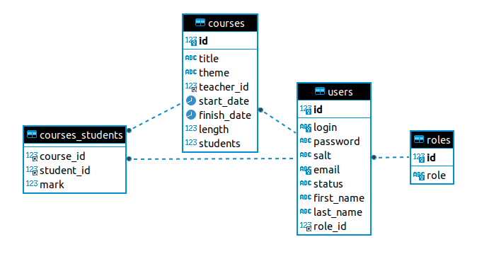

Elective

Факультатив

There is a list of courses divided into topics. One teacher is assigned to each course.

Існує перелік курсів, розбитих за темами. За кожним курсом закріплений один викладач.

It is necessary to implement the following functionality:

Необхідно реалізувати наступну функціональність:

- sort courses by name (az, za), duration, number of students enrolled in the course;
- сортування курсів за назвою (az, za), тривалістю, кількістю студентів, що записалися на курс;

- a selection of courses related to a specific topic;
- вибірка курсів, що належать до певної теми;

- a selection of the teacher courses.
- вибірка курсів певного викладача.

The student enrolls in one or more courses, registration data is stored. At the end of the course the teacher gives the student a grade, which is stored in the journal.

Студент записується на один або декілька курсів, дані про реєстрацію зберігаються. По закінченню курсу викладач виставляє студенту оцінку, яка зберігається в журналі.

Each user has a personal account, which displays brief information about the user, as well as for the student:

Кожен користувач має особистий кабінет, в якому відображена коротка інформація про користувача, а також для студента:

- a list of courses for which the student has registered but which have not yet begun;
- перелік курсів, на які студент зареєструвався, але які ще не почалися;

- a list of courses for which the student has registered and which are in progress;
- перелік курсів, на які студент зареєструвався і які знаходяться в прогресі;

- a list of completed courses with information about grades;
- перелік пройдених курсів з інформацією про успішність;

for the teacher:

для викладача:

- viewing and editing an e-journal for assigned courses.
- перегляд і редагування електронного журналу для закріплених за ним курсів.

The system administrator has the rights:

Адміністратор системи володіє правами:

- registration of the teacher and assignment of the course to him;
- реєстрації викладача і закріплення за ним курсу;

- adding, deleting, editing a course;
- додавання, видалення, редагування курсу;

- blocking, unlocking the student.
- блокування, розблокування студента.

### **DATABASE MODEL**

